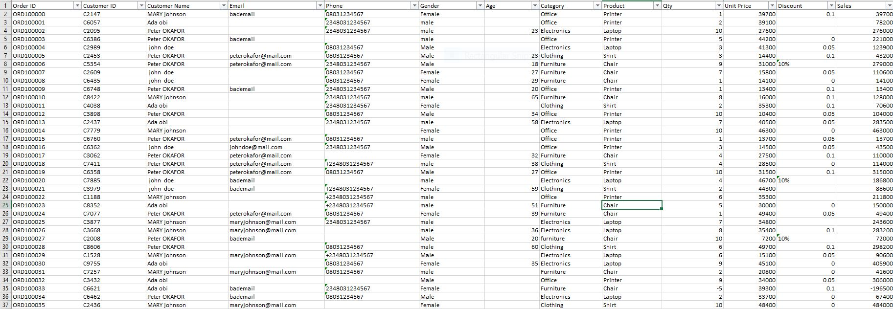
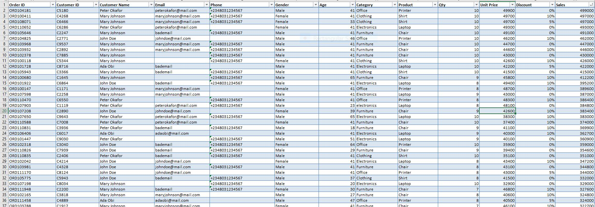

# Retail Sales Data Cleaning & Validation (Excel)

## Project Overview

This project demonstrates the process of cleaning, validating, and preparing a retail sales dataset for analysis using Microsoft Excel.

The raw dataset contained 12,100 rows and 20 columns with various data quality issues, including missing values, duplicate records, inconsistent formatting, invalid numerical values, and business-rule violations.

The goal was to transform the raw dataset into a clean, consistent, and analysis-ready dataset.

---

## Project Objective

To identify and resolve data quality issues in a raw retail sales dataset while preserving valid information and applying appropriate business validation rules.

---

## Dataset

- **Records before cleaning:** 12,100
- **Records after duplicate removal:** 12,000
- **Columns:** 20
- **Tool:** Microsoft Excel

---

## Data Cleaning Process

The following cleaning and validation activities were performed:

- Created a backup of the original dataset before making changes.
- Identified and removed 100 duplicate records.
- Investigated missing values across important columns.
- Calculated the median Age of 41 and used it to fill missing Age values.
- Retained missing Email values where no reliable replacement could be determined.
- Standardized Discount values into a consistent percentage format.
- Corrected negative Quantity values.
- Removed fully blank transaction rows.
- Checked Unit Price and Cost for invalid negative values.
- Investigated negative Profit values and validated the Profit calculation.
- Converted Order Date and Ship Date from text into valid Excel dates using Text to Columns with MDY formatting.
- Created a helper validation column to identify cases where the Ship Date occurred before the Order Date.
- Investigated duplicate Order IDs to distinguish valid multiple line items from actual duplicate records.
- Standardized Nigerian phone numbers into the +234 international format while preserving blank values.
- Used filtering, sorting, conditional formatting, formulas, and helper columns to validate the cleaned data.

---

## Excel Techniques Used

- Excel Tables
- Sort & Filter
- Conditional Formatting
- Text to Columns
- IF
- LEFT
- RIGHT
- TRIM
- PROPER
- MEDIAN
- Paste Special
- Helper Columns
- Data Validation

---

## Before & After

### Raw Dataset

The raw dataset contained inconsistencies such as missing values, duplicate records, mixed formats, invalid numerical values, and inconsistent phone number formats.

### Cleaned Dataset

After applying the cleaning and validation procedures, the dataset was standardized and prepared for analysis.

---

## Documentation

The detailed data cleaning process is available in the project report:

[View Data Cleaning Report](Data_Cleaning_Report.pdf)

---

## Project Outcome

The cleaned dataset was prepared for downstream analysis and reporting.

This project demonstrates practical skills in:

- Data Cleaning
- Data Quality Assessment
- Data Validation
- Data Standardization
- Excel Data Preparation
- Business Rule Validation
- Problem Solving

---

## Tools

**Microsoft Excel**

Excel was used to inspect, clean, validate, standardize, and prepare the dataset for analysis.
